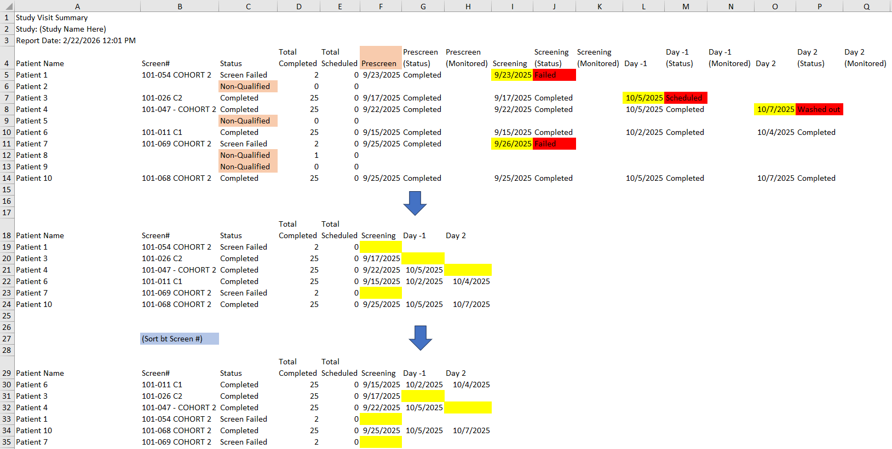

## About

A VBA macro to process data exported from a clinical trial administrator.

## Objectives

The macro performs the following cleanup steps **in order**:

1. **Clear unnecessary dates**  
   For every attribute column group:  
   → If the **Status** column is **not** "Completed", clear the corresponding **Date** column in the same row.

2. **Remove status & monitored columns**  
   Delete all **[Attribute] (Status)** and **[Attribute] (Monitored)** columns across the entire table.  
   → After this step, only **Date** columns remain for each attribute (plus the static left columns).

3. **Delete the Prescreen column**  
   Remove the **Prescreen Date** column entirely (it is typically not needed for final reporting).

4. **Delete non-qualified rows**  
   Remove any row where the main **Status** column (a fixed column near the left) equals **"Non-Qualified"** (case-sensitive, trimmed).

5. **Sort the table**  
   Sort the remaining rows by the **Screen#** column (ascending).  
   → Note: The position of the Screen# column may vary between exports, so the macro should locate it dynamically by header name.

## Final Output Structure (after processing)

- Static columns remain (Patient Name, Status, Screen#, Total Completed, etc.)  
- One date column per relevant attribute (e.g. Screening Date, Day 1 Date, Day 2 Date, …)  
- Prescreen Date removed  
- Non-qualified rows removed  
- Rows sorted by Screen#

## Assumptions & Notes

- Headers are in row 4 (data starts in row 5) — adjust if your exports differ.
- Column headers contain exact or near-exact text (e.g. "Prescreen Date", "Day 1 Status", "(Monitored)", "(Status)").
- "Completed" and "Non-Qualified" are matched case-sensitively with trimming.
- The macro should identify attribute groups dynamically (look for headers containing "(Status)", "(Monitored)").
- Run this macro on a **copy** of your export file first.

## How to Use

1. Open the exported Excel file.
2. Press `Alt + F11` to open the VBA editor.
3. Insert a new module and paste the macro code.
4. Run the macro (e.g. `ProcessClinicalConductorExport`).
5. Review the cleaned table and save.

